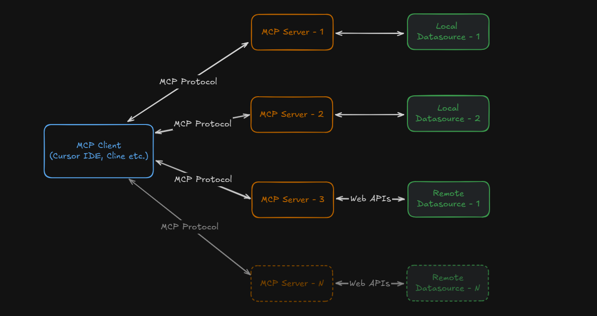

# Model Context Protocol Example

This example demonstrates how to use the Model Context Protocol. For simplicity, this example uses single tool, resource and prompt.

## Installation

```bash
pip install uv
uv init
uv venv

.venv\Scripts\activate # Windows
source .venv/bin/activate # Mac/Linux

uv add mcp[cli] # Option-1
# or
uv add -r requirements.txt # Option-2
```

## Usage



### MCP Server

```bash
# Server
mcp dev server.py

# Need to install the following packages:
# @modelcontextprotocol/inspector@x.x.x
# Ok to proceed? (y) y
```

If you install inspector, you can reach the MCP server details at http://localhost:5173/

### MCP Host (Client)

You can use the client.py file to interact with the server.

```bash
python client.py
```
